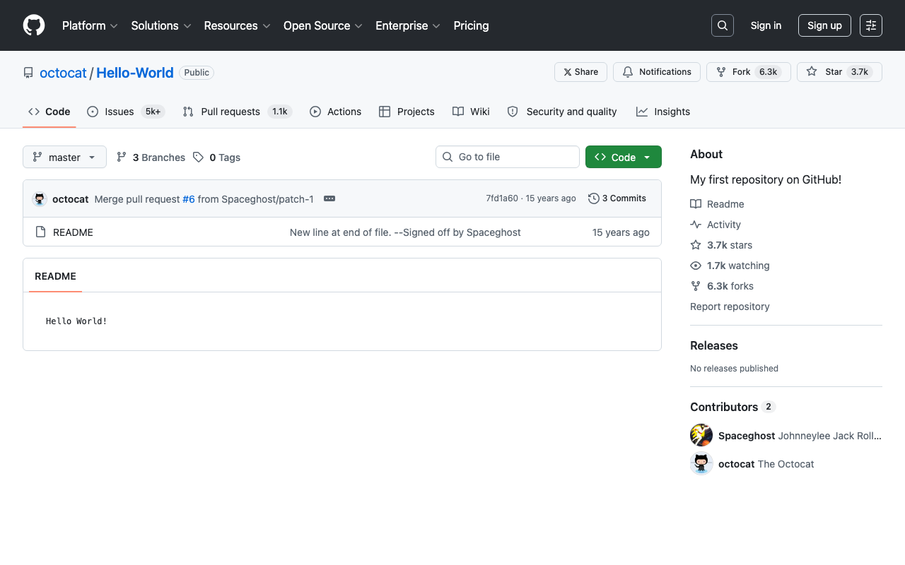

# RepoShout

[](https://chromewebstore.google.com/detail/joaipdjaiefbenoijcekdnjagiadikkd)
[](LICENSE)

GitHubのリポジトリ・Issue・PRを、文面が入ったXの投稿画面でワンクリック共有するChrome拡張。

**投稿ボタンはX側で押します。** この拡張が代わりに投稿することはありません。文面とリンクが入力済みのX投稿画面を開くだけです。

English: [README.md](README.md)



---

## できること

| 場所 | 押し方 |
|---|---|
| リポジトリページ | 画面内の **Share** ボタン（Pin / Watch / Fork / Star の左） |
| Issue・プルリクエスト | 画面内の **Share** ボタン（New issue / Code の左） |
| その他の共有可能なGitHubページ | ツールバーのアイコン、または <kbd>Option</kbd>+<kbd>Shift</kbd>+<kbd>X</kbd>（Windows/Linuxは <kbd>Alt</kbd>+<kbd>Shift</kbd>+<kbd>X</kbd>） |

ツールバーアイコンとショートカットは、ボタンが出ているページも含めて**共有可能なGitHubページ**で使えます。**認証・アカウント・設定・組織管理の画面は、すべての入口で拒否**します。そこでアイコンやショートカットを押しても投稿画面は開かず、代わりに画面へ短い案内が出ます。案内が届かないページでは、ツールバーのアイコンに数秒だけ `!` が付きます。どちらもURLや値そのものは出しません。

やっぱりやめたくなったら、共有ウィンドウで <kbd>Esc</kbd> を押すと閉じます。

文面はページの種類に合わせて変わります。

| ページ | 生成される文面 |
|---|---|
| リポジトリ | `owner/repo` |
| Issue | `Issue #123 · owner/repo` |
| プルリクエスト | `PR #123 · owner/repo` |
| Discussion | `Discussion #123 · owner/repo` |
| Issue / PR / Discussion の一覧 | `Issues · owner/repo`（ほかも同じ形） |
| リリース | `Releases · owner/repo` |
| コミット | `Commit 0123456 · owner/repo` |
| その他 | そもそも共有しません |

例:

```
octocat/Hello-World
https://github.com/octocat/Hello-World
```

RepoShout が共有するのは、ページの**構造**であって、タイトルではありません。Xへ渡るのは、生成した1行と、検査したパーツから組み直したURLだけです——リポジトリなら `owner/repo`、Issue なら `Issue #123 · owner/repo`（PR・Discussion も同じ形）、一覧なら `Issues · owner/repo`、ほかに `Releases · owner/repo` と `Commit 0123456 · owner/repo`。

共有できるのは、**パスの全セグメントが4つの型のどれかで決まるページ**だけです——所有者名・リポジトリ名・正の整数・40桁の16進。ファイル（`/blob/…`）・ツリー・比較・`/commits/<ref>`・Wiki・検索結果・Actions・プロフィールは拒否します。これらのパスには、利用者が何でも書ける文字列が入るからです。フラグメントは落とし、クエリは値の集合を数えられるものだけ残します（ページ番号・`state`・並び順・`?diff=split&w=1`）。

1.1.7 までは `document.title` と生のパスをそのまま送り、資格情報の形を検出器で止めていました。その配布物で実測したところ、**両側から同時に破れました**——定義の外にある現実的な形が37件そのまま投稿画面へ届き（`X-Api-Key:`・`AWS_SECRET_ACCESS_KEY=`・`SAMLResponse=`・`ya29.…`・`hf_…` など）、同時に普通の開発者向け表題4件（`How to parse key=value pairs` を含む）を誤って拒否していました。厳しくすると製品が壊れ、緩めると漏れるので、境界そのものを構造へ移しました。検出器は2層目として残しています。

認証・アカウント・設定・組織管理の画面は、すべての入口で拒否し、黙って終わらずに理由を伝えます。パスはデコードしてから判定するので `/%73ettings/tokens` も拒否し、デコードできないURLは推測せずに共有しません。

共有する側のページでは、クエリはページの種類ごとに扱いを変え、**値の集合を数えられるもの・機械的に確かめられるものだけを残します**——ページ番号、open/closed の状態、並び順と向き、差分表示の `?diff=split&w=1` などです。**自由に書ける欄はすべて落とします**——検索語（`q`・`query`・`discussions_q`）も、識別子のように見える `labels`・`author`・`branch`・`path` も、どのページの表にも載せていません。有限の一覧では「自由文に秘密が入っていない」ことを示せないからです。表に無いものも落ちるので、`?tab=readme-ov-file`・`notification_referrer_id`・`utm_*` は消えます。**フラグメントは行番号アンカーごと落とします。** 1.1.7 までは残していましたが、アンカーは利用者が任意の文字列を置ける場所で、そこが1つ残るだけでこの方式の意味が無くなります。

第16回監査を受けて、1.1.8 でさらに2つ足しました。**同じ名前のクエリは1回まで**——`?state=open&state=closed` はどちらかを選ばず、URLごと共有しません。繰り返せる場所は任意長の通り道で、値の集合が有限でも、1,000回繰り返せば利用者が決めた並びを12,000文字ぶんXへ運べたためです。もう1つは、**出て行くクエリを表の順に固定し、値を決まった書き方へ直す**こと（`page=007` は `page=7`、`w=true` は `w=1`）。同じ画面からは必ず同じリンクが出ます。

**GitHubの機能ページはリポジトリではありません。** `/enterprises/<slug>`・`/oauth/authorize`・`/login/device`・`/settings/…`・`/password_reset`・`/customer-stories/…`・`/resources/…` などは、**既知の名前を集めた単一の一覧**で拒否します。ルートを決めるすべての経路が同じ一覧を見ます。

ここに挙げた例は文章ではなく `store/DATA_FLOW_CLAIMS.json` に置いてあり、**1件ずつ出荷するコードへ通して判定を突き合わせて**います。**共有できたままであるべき対照**も一緒に通します——`https://github.com/user/bitmap-fonts`、`https://github.com/github/docs`、そして `user` がGitHubに実在する所有者名であることから `https://github.com/user/keys`（ふつうのリポジトリのルートです）。<!-- HISTORICAL_CLAIM:start reason="第20回までこの一覧が挙げていた誤った例。現在は挙げていない" -->（第22回監査まで、拒否する側の一覧に最後の1つを挙げていました。）<!-- HISTORICAL_CLAIM:end -->第16回監査までは同じ境界を2つの配列で持ち、共有を組み立てる側は片方しか見ていなかったので、`github.com/enterprises/acme` を「`enterprises/acme` というリポジトリ」として共有していました。

**これは「拒否する名前の一覧」であって、「その名前が実在の所有者だ」と示すものではありません。** GitHubが新しい機能ページを増やせば、その名前は一覧を直すまでリポジトリとして扱われます。一覧へ足すのは、`github.com/<名前>` がGitHubの側で開けて、**かつその名前のアカウントが無い**ことを確かめたものだけです（アカウントが無ければ、そこにリポジトリは作れない＝拒否しても実在のリポジトリを巻き込まない）。`skills`・`accessibility`・`security-lab` は機能ページのように見えますが、公開リポジトリを持つ実在の組織なので**わざと足していません**。

方針の正本は [`src/share.js`](src/share.js) の `QUERY_RULES` 表で、各パラメータに**許す値の型**（`int` / `bool` / `enum`）を書いてあります。全項目を [`test/fixtures.js`](test/fixtures.js) で検査しています。

## 導入方法

### Chrome ウェブストアから

**[RepoShout をインストール](https://chromewebstore.google.com/detail/joaipdjaiefbenoijcekdnjagiadikkd)** — 自動で更新されるので、通常はこちらを使ってください。公開中のバージョンは上のバッジに出ます。

### ソースから読み込む

コードを改造して使いたい場合や、Chrome ウェブストアを使えないChromium系ブラウザで使う場合はこちら。

1. このリポジトリをダウンロードまたはクローンする
2. `chrome://extensions` を開く（Arcは `arc://extensions`、Braveは `brave://extensions`、Edgeは `edge://extensions`）
3. **デベロッパー モード** をオンにする
4. **パッケージ化されていない拡張機能を読み込む** を押し、このフォルダを選ぶ

読み込んだあと、既に開いているGitHubのタブは再読込してください。コンテンツスクリプトはページ読み込み時に入るためです。

### ショートカットを変えたいとき

`chrome://extensions/shortcuts` で変更できます。

Windows では <kbd>Alt</kbd>+<kbd>Shift</kbd> 単体がキーボードレイアウトの切替に割り当たっています。入力言語を複数入れている環境でショートカットの効きが怪しいときは、ここで割り当て直してください（<kbd>Ctrl</kbd>+<kbd>Shift</kbd>+<kbd>X</kbd> はたいてい空いています）。

### 表示言語

ボタン・ツールチップ・ツールバーアイコンの説明は、ブラウザの表示言語に従います。同梱しているのは英語と日本語（`_locales/`）で、それ以外の言語では英語になります。画面に出る文字を特定の言語で直書きしていないことは、テストで検査しています。

## 先行・類似の実装について

これが初めての試みではありません。そこは正直に書いておきます。

[RepoCast](https://chromewebstore.google.com/detail/lpkhpmjlkjgdlnajljaipakcnhgdodfe)（v1.0.5・2026-07-18更新・執筆時点で利用者3人）は近い領域を扱っています。GitHubのリポジトリページにボタンを追加し、サイドパネルでX・LinkedIn・Reddit・WhatsApp・Discord向けの共有文と共有カードを生成する拡張です。それ以前の試み——[chrome-ext-github-tweet-button](https://github.com/joshbuchea/chrome-ext-github-tweet-button)（2018年アーカイブ）、[gitShare](https://github.com/LukyVj/gitShare)（2015年）、[chrome-share-on-twitter](https://github.com/robertoentringer/chrome-share-on-twitter)（2021年）——はいずれも更新が止まっており、ChromeのManifest V2停止より前の世代なので現在は動きません。

RepoShout は RepoCast より意図的に狭く作っています（宛先はXのみ、サイドパネルなし、カード生成なし）。そのうえで、好みではなく実測から出てきた違いが3つあります。

- **ログイン状態とログアウト状態の両方に対応している。この2つは実装が別物です。** ログアウト時は旧来の `ul.pagehead-actions`、ログイン時のリポジトリページは `data-testid="repo-header-actions"` を持つReactのヘッダ、ログイン時のIssue/PRはさらに別で Primer PageHeader のアクション枠（`data-component="PH_Actions"`）を使います。3つとも、ハッシュ化されるCSSクラス名ではなくGitHubが自前のツールのために安定させている属性です
- **文字数を、X自身の実装と突き合わせて検査している。少なく数えるより多く数える側へ倒してある。** 拡張が積んでいるのは小さな自前の計数器で、配布物に第三者コードは入りません。そのうえでテストが `twitter-text` 3.1.0 を判定器として動かし、すべてのfixture・固定した公式コーパスの文字数対象節・数千件の敵対的コーパスに対して、**1件でも公式を下回ったら落ちる**ようにしてあります。この範囲では過少計数は検出されていませんが、有限の回帰検査であって、全入力や将来のXの挙動に対する証明ではありません。少なく数える方向だけが「Xに弾かれる文面を作る」事故になり、多く数えるのは少し早く切り詰めるだけです。過去2版はどちらも少なく数えており、測るまで誰も気づきませんでした（半角カタカナを1、スキーム無しドメインを素の長さ）
- **Open / Merged / Closed の状態を意図的に出していない。** 同じプルリクエストに対して、ログイン状態とログアウト状態で読み取れる値が食い違う事象を検証中に観測したため、誤った情報を公開しないよう外しています

## 設計方針

GitHubの画面にUIを差し込む拡張は、GitHubの改修で壊れるのが常です（上に挙げた先行実装が止まっているのがその証拠です）。RepoShout は「壊れない」ことではなく「**どう壊れるか**」を限定する設計にしています。

- **目印が見つからなければ、ボタンを置きません。** エラーも出さず、代替のDOM操作もせず、GitHubの画面を壊しません。これはボタンの話だけで、ツールバーアイコンとショートカットはそのページでも動き、共有できなければ下の案内を出します
- **GitHubの既存DOMは読むだけ。** 追加するのは、ボタン1個を入れる器（リポジトリページは `<ul>` の中なので `<li>`、Issue/PRはflex行の中なので `<div>`）と、head に入れる `<style>` 1個です。共有できなかったときは、`<body>` へ `<div id="gxs-notice">` を1つ足します——数秒で自分から消え、URL・パラメータ名・値は含みません。**ボタンを置けなかったページでも足します。** 既存の要素を削除も置換もしません
- **ボタンを置くために読むのは、決まった範囲だけ。** 器があるか、その先頭の子がどう作られているか（`children`・`tagName`）、位置をそろえるための表示値3つ（`display`・`cssFloat`・`marginRight`）、隣のボタンの高さ。ページの本文も、入力欄の値も、URLも、タイトルも読みません
- **どのボタンがあるかを一切見ません。** ログイン時とログアウト時でボタン構成は違いますが、コンテナの先頭に足すだけなので同じコードで両方に対応します。将来GitHubがボタンを増減させても同じです
- **ツールバーとショートカットはDOMに一切触れません。** タブのURLだけで動くので、画面内ボタンが出なくなっても機能は生き続けます
- 色はGitHub自身のテーマ変数（`--button-default-*`）から取るため、ライト/ダークに自動追従します

## 権限

要求するAPI権限は2つです。

| 権限 | 用途 |
|---|---|
| `activeTab` | 見ているタブのURLを読むため（1.1.8 以降、ページのタイトルは読みません）。Chromeの設計上、利用者が拡張を明示的に操作した瞬間（ツールバー押下・ショートカット）に、そのタブに対してのみ付与されます。バックグラウンドでの閲覧監視はできません |
| `storage` | 拡張自身が開いたウィンドウを覚えておき（ウィンドウIDと開いた時刻）、Escでそれ**だけ**を閉じるため。保存先は `chrome.storage.session` で、メモリ上にしか置かれず、ディスクにも書かれず、コンテンツスクリプトからは読めません。Chromeが消すのは、ブラウザの終了時と、この拡張を無効化・再読み込み・更新したときです |

`storage` は 1.1.0 で追加しました。入るのはウィンドウIDと開いた時刻だけで、URL・ページのタイトル・ページ内容・所有者名・リポジトリ名・投稿本文・閲覧履歴は入りません。**この記録を外部へ送ることはありません。** 12時間を過ぎた記録は「拡張が開いた窓」の根拠として数えなくなりますが、これは**消す期限ではなく、根拠として使わなくなるという意味**で、実際に消えるのは次に誰かがその記録を見たときです。

コンテンツスクリプトは2つのサイトで動きます。

| サイト | 目的 |
|---|---|
| `github.com` | Share ボタンの設置。ページを読むのはボタン行を探し、隣のボタンと見た目をそろえるため（決まった範囲＝有無・先頭の子・表示値3つ・高さ1つ）。足すのは `<style>` 1つとボタン1個を包む要素1つ、および共有できなかったときの一時的な案内1つです。GitHub側の要素は消しも置き換えもしません。押されたときに service worker へ送るのは「押されました」だけで、URLも文面もこちらでは組み立てません。 |
| `x.com` | **Escキーの検知だけ** — 出したくなかった共有ウィンドウをその場で閉じられるようにするためです。 |

X側のスクリプトはページの中身を一切読みません。ウィンドウを閉じる前に、service workerへ「これはあなたが開いた窓か」とだけ尋ねます。答えの根拠は `chrome.windows.create()` が返したウィンドウIDだけで、これはページ側から読むことも詐称することもできません。

1.0.1 までは `window.name` が特定の固定文字列であることも根拠にしていました。その文字列はこの公開リポジトリに書かれており、どのページでも同じ名前の窓を開けるので、証明になっていませんでした。1.1.0 で削除しています。**通常のXのタブを閉じることはできません**——この点は、旧版の固定名で窓を開いてEscを押すE2Eテストで確認しています。

拡張はバックグラウンドでの通信を行わず、独自のサーバーとも通信しません。ただし**2つの値はXへ渡ります**——ページのルートから生成した1行と正規化済みURLが、投稿画面のリンクの一部として、画面が開いた時点でXへ届きます（投稿するかを決める前です）。これは副作用ではなく機能そのものですが、はっきり書いておきます: **機密のページではShareを押さないでください**。拡張自身が保存するのは上記のウィンドウIDと開いた時刻だけで、メモリ上にしか置かれません。詳細は [PRIVACY.md](PRIVACY.md) を参照してください。

## 構成

```
manifest.json             Manifest V3 の定義
src/share.js              文面とURLの組み立て（DOMを見ない純粋なロジック）
src/content.js            画面内ボタンの設置
src/background.js         ウィンドウの生成とEscの所有権管理（service worker）
src/esc-close.js          x.com側のEsc処理
icons/                    アイコン
test/fixtures.js          期待値の表（Nodeとブラウザで共通）
test/*.test.mjs           Node のテスト
test/share.test.html      同じ表をブラウザで見る用（任意・目視確認）
scripts/package.mjs       決定論的なZIP生成
scripts/package-files.mjs 出荷するファイルの一覧（ここが正本）
```

## テスト

まっさらなクローンから、この3つで通ります。

```bash
npm ci
npm test          # 単体 + 適合 + 実拡張E2E
npm run package   # dist/reposhout-<version>.zip と SHA-256
```

必要なもの: Node 22+、Chrome または Chromium（`CHROME_PATH` か既定の場所から探します）、E2Eの使い捨て証明書用に `openssl`。**拡張そのものの実行時依存はゼロです**（`package.json` の `dependencies` は空で、`node_modules/` の中身は配布物に入りません）。`npm ci` が入れるのはテスト専用の `twitter-text` 3.1.0 が1つだけで、文字数のテストが判定器として使います。

| 種類 | コマンド | 内容 |
|---|---|---|
| 単体・オラクル | `npm run test:unit` | 手書きの期待値（URL方針・機微ルートの拒否・サフィックス保持・タイトル整形・切り詰めの安全性）に加え、`twitter-text` 3.1.0 を判定器として、生成した敵対的コーパスと突き合わせます |
| 公式コーパス | `npm run test:conformance` | Twitter公式の `conformance/validate.yml` のうち**文字数の3節（44件）**を実際に走らせます。上流のコミットとSHA-256で固定して同梱しており、配布物には入りません |
| 配布物の作成 | `npm run test:package` | 書き込みを1つずつ意図的に失敗させて、前の成果物が残ること・中途半端なものが残らないこと・`-dirty` で作ったZIPは記録上の名前も `-dirty` になることを検査します |
| manifest・配布物 | 上に含まれる | Manifest V3 の妥当性、権限一覧（権限が増えると落ちます）、外部コードの混入検査、出荷ファイル一覧の固定 |
| 実拡張E2E | `npm run test:e2e` | `scripts/package-files.mjs` に挙げたファイルだけを `Extensions.loadUnpacked` で本物のChromeへ読み込み、`x.com` と `github.com` をローカルのHTTPSサーバへ向けて、実際の service worker を通して確認します |
| ブラウザ版 | `test/share.test.html` を開く | 同じ期待値を表で表示。実際の出力を目で見たいとき用 |

文字数について: 公式コーパスと生成した敵対的コーパスを走らせた**範囲では、公式より少なく数えた例は出ていません**。有限の入力に対する回帰検査であって、全入力に対する証明ではありません。

Escの挙動は拡張全体の性質なので、確認はE2Eが担当します。

| ケース | 期待 |
|---|---|
| 拡張が開いたウィンドウで Esc | 閉じる |
| 同上・**service workerを止めた後** | **それでも閉じる** |
| **旧版の固定名を偽装した窓で Esc** | **閉じない** |
| 自分で開いたXのタブで Esc | 閉じない |
| Shift+Esc | 閉じない |
| 窓を閉じた後、そのIDは忘れられる | 古い記録が許可として残らない |

2026-08-06 実測（1.1.4）: 単体90件 PASS / 0 FAIL、E2E 10件 PASS / 0 FAIL。件数は動くので、正確な値は `npm test` の出力を見てください。Escの2件は 1.0.1 の実装に戻すと落ちることも確かめています（落ちないテストは何も証明しません）。

## 検証状況

2026-07-31〜08-02に、実際のGitHubに対してログイン・ログアウトの両状態で計測しました。

| 項目 | 結果 |
|---|---|
| ボタン位置（ログアウト時） | 左端・高さが隣と完全一致・上端も一致 |
| ボタン位置（ログイン時） | 同上 |
| ボタン位置（ログイン時のIssue/PR） | New issue / Code のすぐ左。高さ31.997px対31.997px・上端差0.000px |
| 目印の排他性 | 3つのコンテナが同時に存在するページは無し。`PH_Actions` が出るのは `/issues`・`/issues/N`・`/pull/N` のみで、リポジトリ直下・Actions・ファイル表示・通知・設定には無い |
| ダークモード | 背景・文字・枠線がGitHub自身のボタンと同じ値に解決される |
| クライアント側遷移 | ボタンは生存。文面はクリック時に再計算 |
| リポジトリをまたぐ移動 | 移動先で正しく再表示され、文面も移動先のものになる |
| ブラウザの戻る/進む | どちらの後もボタンあり |
| 消された場合の自己修復 | 表示中のタブなら約1秒で復帰 |
| 二重注入 | 防止を確認 |

### 敵対的レビューで直した3件

コードを4観点（Manifest V3妥当性・セキュリティ・DOM耐久性・文面ロジック）でレビューし、出た30件の指摘を1件ずつ別のレビュアーが反証を試みる形で検証しました。26件は実害なしとして棄却され、3件が実在の不具合として残り、修正済みです。

| 深刻度 | 内容 | 修正 |
|---|---|---|
| major | 絵文字がちょうど切り詰め位置に来るとサロゲートペアが分断され、`encodeURIComponent` が例外を投げていた。誰も受け止めていなかったため、**全ての入口が無言で何もしない**状態になった | コードポイント単位で切るよう変更。例外時はURLのみの共有にフォールバック。251の境界位置で失敗0件（旧実装は25件） |
| minor | Xの文字数計算は全角文字を2として数える仕様とされる（twitter-text の weighted ranges に準拠して実装・2026-07-31実測）。単純な文字数で切ると、日本語では約129文字から280を超えていた | 重み付き文字数で切るよう変更。日本語400文字でもX換算274/280 |
| minor | `/orgs/{org}/discussions/{n}` を「`orgs/{org}` というリポジトリ」と誤判定し、存在しないリポジトリ名を投稿文に入れていた | GitHubの予約名前空間を除外 |

### 1.1.0 で直した4件（2回目のレビュー）

公開済みの 1.0.1 に対する2回目のレビューで4件の指摘が出ました。どれも**先に出荷済みコードで再現させてから**直し、修正を守るテストが旧実装では落ちることも確認しています。

| 深刻度 | 内容 | 修正 |
|---|---|---|
| major | クエリを全部落としていたため、`/issues?q=is:open label:bug` が素のIssue一覧になり、`?plain=1` が消える一方で `#L14` だけが残り（`plain=1` が無いと機能しないアンカー）、下書き中のプルリクエストはタイトルも本文も失われていた。READMEには「追跡パラメータだけ除去」と書いてあり、実装と食い違っていた | ページ種別ごとのallowlistへ変更。意味のあるものは残し、知らないものは落とし、認証・設定系ではクエリもハッシュも捨てる |
| major | 文字の重みが twitter-text の近似——既定1でCJKだけ2という、本来と逆の規則だった。半角カタカナ・矢印・記号・ラテン拡張をXが2と数えるところ1と数えており、長いタイトルでは**Xが受け付けない投稿**を作りうる。逆にZWJの家族絵文字は2ではなく11と数え、絵文字の多いタイトルを早く切り詰めていた | twitter-text v3 の定義どおりに（既定2・重み1の4範囲・絵文字は書記素単位・URLは23・先にNFC） |
| major | Escは「`window.name` が公開リポジトリに書かれた定数と一致するか」で閉じており、service workerが持つ自分の窓の記録はメモリ上だけだった。Chromeがワーカーを止めた後（数十秒）は、正規の共有ウィンドウでEscが無言で効かなくなっていた | 3経路とも service worker がウィンドウを生成し、所有権はウィンドウIDのみ。記録は `chrome.storage.session` に置き、ワーカーの再起動をまたいで残る |
| major | 依存なしでテストを走らせる手段もCIも無く、ZIPは手作業だったので、提出物がリポジトリと一致するかを確かめられなかった | `npm ci && npm test && npm run package`、同じコマンドを回すGitHub Actions、毎回同じSHA-256になる決定論的なZIP生成 |

## 既知の制限

- **ウィンドウ幅が狭いとボタンは出ません。** GitHubが自身のFork/Star行を隠す幅に合わせているためです。これは意図的で、GitHubのレイアウトと戦うことが拡張の壊れる原因になります
- **リポジトリ・Issue・PR以外のページには、ログイン時は画面内ボタンが出ません。** Actionsの実行画面・ファイル表示・通知には、ボタンを置くべきアクション行がないためです。共有できる他のページはツールバーアイコンとショートカットで代替します。**設定・認証・アカウント・組織管理の画面は、ツールバーとショートカットを含むすべての入口で拒否**するので、そもそも共有されません
- **ページのタイトルは送りません**（1.1.8）。投稿本文はルートから生成します——`owner/repo`、`Issue #123 · owner/repo`、`Issues · owner/repo`、`Commit 0123456 · owner/repo`。利用者が打ち込めるもの（表題・説明・ファイル名・ブランチ名）は、1つもXへ渡りません。
- **共有できるのは、全セグメントが型で決まるルートだけ**です——所有者名・リポジトリ名・正の整数・40桁の16進。`/blob/…`・`/tree/…`・`/compare/…`・`/commits/<ref>`・Wiki・検索・Actions・プロフィールは拒否し、URLは素通しせず検査済みのパーツから組み直します。
- **フラグメントは落とし、クエリは数えられる値だけ残します**——ページ番号・`state`・並び順・真偽値。検索語や下書きの `title`・`body`、`labels`・`author` のような識別子っぽい値は、そもそも表に載っていないのでURLにも入りません。
- **資格情報の検出器は2層目で、主たる境界ではありません。** トークンの形をしたリポジトリ名は今も拒否しますし、あいまいにしかデコードできないURLも拒否します。見ているのは定義した形だけで、あらゆる秘密を検出できるという意味ではありません——だからこそ、自由に書けるものは最初から運びません。
- **Open / Merged / Closed の状態は文面に含めません。** 同じプルリクエストに対して、ログイン状態とログアウト状態で読み取れる値が食い違う事象を検証中に観測したため、誤った情報を公開しないよう外しています
- `github.com` のみ対応。GitHub Enterprise と Gist は対象外です
- **非公開リポジトリかどうかは、URLだけでは判別できません。** 認証・設定系のページは拡張が拒否しますが、通常のリポジトリページで「所有者名とリポジトリ名をXへ送ってよいか」は利用者の判断になります
- 実行時の文字数計算は公式 `twitter-text` パーサーそのものではありません（テストで突き合わせています）。公式の `validate.yml` のうち**文字数の3節は実際に走らせています**が、URL抽出・autolink・TLDの各suiteは走らせていません。X本体の実際の挙動も検査していません
- 今後GitHubが画面を改修した後の挙動は、原理的に事前検証できません

## ライセンス

[MIT](LICENSE)

## 商標について

本拡張は X Corp. および GitHub, Inc. とは無関係で、両社による承認・後援を受けていません。
X および X のロゴは X Corp. の商標です。GitHub は GitHub, Inc. の商標です。
